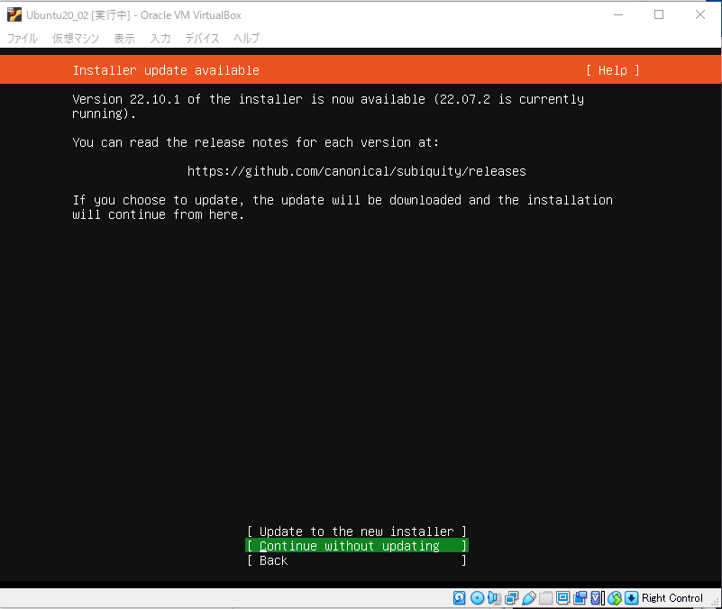

## VirtualBoxにUbuntu20.04LTSインストール

### UbuntuのISOダウンロード
以下のリンクからubuntu-20.04.5-live-server-amd64.isoをダウンロード

[ubuntu-20.04.5-live-server-amd64.iso](https://releases.ubuntu.com/focal/ubuntu-20.04.5-live-server-amd64.iso)

### VirtualBoxの設定

#### VirtualBoxの画面サイズを広くしておく
###### ファイル→環境設定→ディスプレイの画面を開く


###### ゲストスクリーンのサイズを最大化→ヒント
###### 幅→720
###### 高さ→540に設定してOKを押下
(インストール画面の下部が表示されず、Doneボタンなどが見えないことがある為)


### ubuntuのVM設定
##### ネットワーク→ブリッジアダプター
※一番上の選択肢を設定する
※PCがWi-fiで接続している場合は、Wi-fiのアダプターを選択する


ブリッジアダプターは、ローカルエリアネットワーク上に、もう一台別のマシンを立ち上げた形にするものです。

こう設定すると、この仮想マシンはLAN内に独自のIPアドレスを持ち、且つインターネットにも接続できます。

仮想マシンを立てたPCからも、あたかもLAN内に他のマシンがあるように、sshやftpで接続できます。


##### メモリ→2048MB
##### ストレージはvdiタイプを選び、サイズ固定で20GBに作成
##### ストレージ→光学ディスクドライブ→追加→ダウンロードしたUbuntuのisoを指定して選択

##### VMを起動する→インストールが開始される
### Tabで項目を移動、方向キーで選択、Enterで決定

#### 言語はとりあえずEnglishを選ぶ

#### 22へのアップデート確認
Continue without updatinを選んでEnter


#### キーボードを日本語に設定
Japanese > Japanese</br>


#### インストールタイプは、そのままdone


#### PCのネットワーク構成を調べる
次は仮想マシンのネットワーク設定を行いますが、正しい設定を行う為、この仮想マシンが置かれるLANの環境を調べておきます。
##### ローカルエリアネットワーク内の自分のIP、サブネットマスク、デフォルトゲートウェイを確認

##### Windows、mac共通
##### コマンドプロンプト(ターミナル)で以下のコマンドを打つ
```
ipconfig
```


###### Macの場合以下の方法でも確認できます
[MacOSでの確認方法](https://minto.tech/mac-ipaddress/)
PCのIP、サブネット、デフォルトゲートウェイを確認したら、ネットワーク設定に進みます。


### ネットワークを固定IPに設定する
#### enp0s3 eth の設定で、Edit IPv4を選択し、Enter


#### IPv4 MethodのManualを選択


#### Search Domain以外の入力欄を調べた情報を元に入力する
##### Subnet
このマシンが属するLANで利用可能なIPアドレスの範囲を指定する</br>
デフォルトゲートウェイのIPとサブネットマスクから計算して入力</br>
最初の3つの数字はデフォルトゲートウェイのIPと同じにし、4つ目の数字は0にする

例1：</br>
デフォルトゲートウェイ192.168.0.1 → 192.168.0.0</br>
サブネットマスク255.255.255.0 → 末尾は/24</br>
上記の場合の入力値は、192.168.0.0/24</br>
このLANでは、192.168.0.1～192.168.0.255までのIPアドレスが利用可能

例2：</br>
デフォルトゲートウェイ192.168.154.1 → 192.168.154.0</br>
サブネットマスク255.255.254.0 → 末尾は/23</br>
上記の入力値は、192.168.154.0/23</br>
このLANでは、192.168.154.1～192.168.155.255までのIPアドレスが利用可能

##### Address
この入力値が、仮想マシンのローカルIPアドレスになる</br>
デフォルトゲートウェイのIPの4つ目の数字を200番台にして指定</br>
例1なら、192.168.0.200～、例2なら、192.168.154.200～又は192.168.155.200～</br>
他の端末の迷惑にならないよう、あまり使われない(であろう)IPに固定する

##### Gateway
外部インターネットと通信する為のゲートを指定</br>
デフォルトゲートウェイのIPをそのまま入力

##### Name servers
デフォルトゲートウェイのIPと、8.8.8.8とカンマで区切って入力</br>
8.8.8.8は、米国GoogleのDNSサーバーのIPアドレス</br>

##### Search Domains
入力不要

##### 全て入力したら、Saveを選択し、Enter


##### enp0s3の設定がstatic、指定IPになっていることを確認し、Doneを選びEnter


#### proxy
何もせずDoneを選びEnter</br>


#### Ubuntuアーカイブミラー設定
何もせずDoneを選びEnter</br>


#### ストレージ設定
Use an entire diskにチェック(X)が入っていることを確認し、Doneを選びEnter


#### 確認画面
内容を確認し、Doneを選びEnter


#### ディスクが消去される旨確認される
Continueを選びEnter</br>


#### プロファイルのセットアップ
ログインユーザ名、パスワード、サーバー名などを指定(ここは任意で)


#### SSH Setup
#スペースキーを押下し、Install OpenSSH Serverにチェック(X)を入れてDone
パスワードのみでログインできるようにするため、鍵のインポートは行わない
(必要なら、後で設定してください)


☆追加パッケージの選択
#何も選ばずDone

### インストールが完了したら、一旦仮想マシンの電源を切る(右上のXボタン)
VirtualBoxの設定で、追加したUbuntuのISOの割り当てを除去してから起動する</br>
色々ログが表示されているが、画面最下部にアンダースコアのカーソルが表示されていれば起動は成功</br>
ここに先ほど指定したユーザー名を入れ、パスワードを入力してログインする


### Cloud-init無効化
不要なパッケージの上ログイン時にWarningがうるさいので無効化する</br>
```
sudo touch /etc/cloud/cloud-init.disabled
```


### 内向きと外向きのネット接続確認
デフォルトゲートウェイとGoogleにpingを打ってみる</br>
(最初のコマンドはIP調査時の、自分のゲートウェイのIPに変えてください)
```
ping 192.168.0.1
ping google.com
```


このように、内外両方にpingが通っていればOK</br>
どちらかでもpingが通らなかった場合は、ネットの設定に不備があります</br>
VirtualBoxのネットーワーク設定とUbuntuのnetplanを見直してください

### SSHで接続
お使いのターミナルに仮想マシンのIPのポート22に接続します</br>


☆vimの設定ファイルを作る
```
/home/ユーザ/.vimrc
vim .vimrc
```

```
set fileformats=unix,dos,mac
set enc=utf-8
set fenc=utf-8
set nobackup
set noswapfile
set autoread
set hidden
set showcmd

set number
set virtualedit=onemore
set smartindent
set showmatch
set laststatus=2
set wildmode=list:longest
nnoremap j gj
nnoremap k gk

set list listchars=tab:\>\>
set expandtab
set tabstop=2
set shiftwidth=2
set ignorecase
set smartcase
set incsearch
set wrapscan
set hlsearch
hi Comment ctermfg=DarkCyan
```

#sudoでvimを利用する場合の.vimrcも作成しておく
sudo su -
cp /home/mu/.vimrc .vimrc
exit


<script src="https://blz-soft.github.io/md_style/release/v1.2/md_style.js" ></script>
